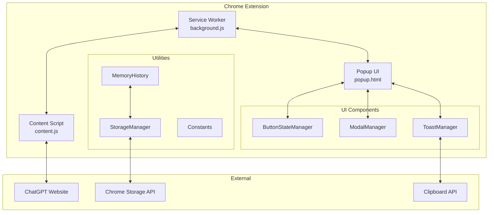
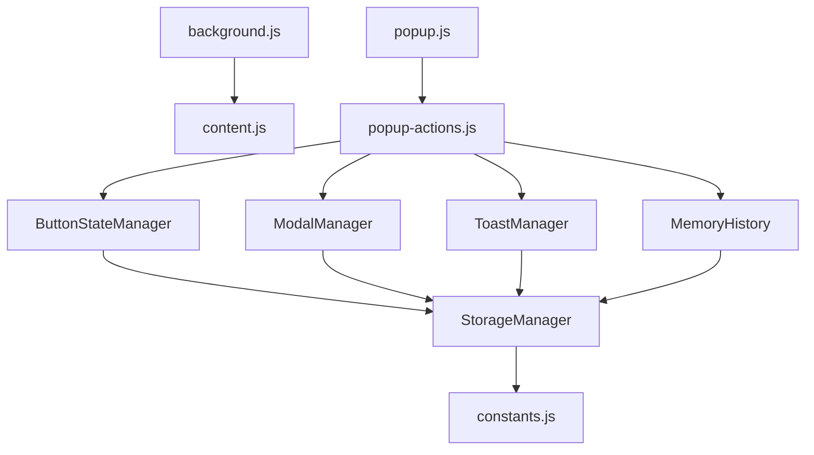
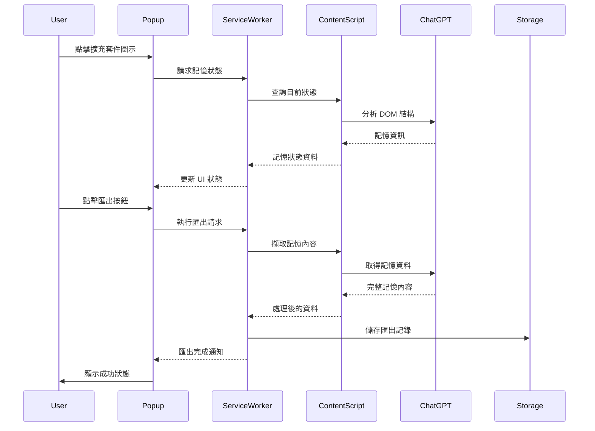

# 架構文件 | Architecture Documentation

> ChatGPT Memory Toolkit v1.6.2 系統架構設計  
> System architecture design for ChatGPT Memory Toolkit v1.6.2

---

## 目錄 | Table of Contents

- [系統概覽](#系統概覽--system-overview)
- [Manifest V3 架構](#manifest-v3-架構--manifest-v3-architecture)
- [模組設計](#模組設計--module-design)
- [資料流程](#資料流程--data-flow)
- [安全模型](#安全模型--security-model)
- [效能優化](#效能優化--performance-optimization)

---

## 系統概覽 | System Overview

### 🏗️ 整體架構原則

**設計理念**:
- **模組化**: 清晰的模組邊界和責任分離
- **安全性**: 最小權限原則和內容安全政策
- **效能**: 優化載入時間和記憶體使用
- **可維護性**: 易於理解和擴展的程式碼結構

**核心架構模式**:
```
Chrome Extension (Manifest V3)
├── Service Worker Pattern (背景處理)
├── Content Script Injection (頁面互動)
├── Component-Based UI (模組化介面)
└── Chrome Storage API (資料持久化)
```

### 📊 系統元件圖



---

## Manifest V3 架構 | Manifest V3 Architecture

### ⭐ Manifest V3 優勢

**相較於 Manifest V2 的改進**:
1. **Service Worker**: 取代持續運行的背景頁面
2. **動態權限**: 更精細的權限控制
3. **內容安全政策**: 增強的安全性
4. **現代 API**: 使用最新的 Chrome Extension API

### 🔧 核心配置

**manifest.json 結構**:
```json
{
  "manifest_version": 3,
  "name": "ChatGPT Memory Toolkit",
  "version": "1.6.2",
  
  "permissions": [
    "activeTab",    // 存取當前分頁
    "scripting",    // 注入內容腳本
    "storage",      // 本地資料儲存
    "tabs"          // 分頁管理
  ],
  
  "host_permissions": [
    "https://chatgpt.com/*"  // 僅限 ChatGPT 網域
  ],
  
  "background": {
    "service_worker": "src/background.js"
  },
  
  "content_scripts": [{
    "matches": ["https://chatgpt.com/*"],
    "js": ["src/scripts/content.js"],
    "run_at": "document_end"
  }],
  
  "action": {
    "default_popup": "src/ui/popup.html"
  }
}
```

### 🔄 Service Worker 生命週期

**Service Worker 運作模式**:
```javascript
// Service Worker 生命週期管理
class ServiceWorkerManager {
  constructor() {
    this.setupEventListeners();
    this.initializeExtension();
  }
  
  setupEventListeners() {
    // 安裝事件
    chrome.runtime.onInstalled.addListener(this.handleInstall);
    
    // 啟動事件
    chrome.runtime.onStartup.addListener(this.handleStartup);
    
    // 訊息處理
    chrome.runtime.onMessage.addListener(this.handleMessage);
    
    // 分頁更新
    chrome.tabs.onUpdated.addListener(this.handleTabUpdate);
  }
}
```

**事件驅動架構**:
```
擴充套件安裝 → Service Worker 註冊
分頁載入 ChatGPT → Content Script 注入
用戶點擊圖示 → Popup 開啟
記憶狀態變化 → UI 更新
匯出操作 → 跨腳本通訊
```

---

## 模組設計 | Module Design

### 🧩 ES Module 系統

**模組架構優勢**:
- **Tree Shaking**: 自動移除未使用的程式碼
- **靜態分析**: 編譯時依賴解析
- **類型安全**: 明確的匯入/匯出接口
- **開發體驗**: 更好的IDE支援

### 📁 檔案系統結構

```
src/
├── background.js                 # Service Worker 主程序
├── scripts/
│   └── content.js               # 內容腳本 - ChatGPT 頁面互動
├── ui/
│   ├── components/              # 模組化 UI 組件
│   │   ├── ButtonStateManager.js   # 按鈕狀態管理
│   │   ├── ModalManager.js         # 模態視窗管理
│   │   ├── ToastManager.js         # 通知系統
│   │   └── index.js                # 組件統一匯出
│   ├── popup.html               # 主要彈出介面
│   ├── popup.css                # 樣式系統
│   ├── popup.js                 # 彈出視窗控制器
│   └── popup-actions.js         # 動作處理器
└── utils/
    ├── constants.js             # 應用程式常數
    ├── storage-manager.js       # 儲存管理包裝器
    └── memory-history.js        # 記憶歷史管理
```

### 🔗 模組相依關係

**依賴關係圖**:


### 🎯 核心模組詳解

#### **Service Worker (background.js)**
```javascript
/**
 * Service Worker - 擴充套件的背景處理核心
 * 負責：跨腳本通訊、狀態管理、事件協調
 */
class BackgroundService {
  constructor() {
    this.memoryState = new Map();
    this.activeConnections = new Set();
  }
  
  // 處理來自 Content Script 的訊息
  async handleContentMessage(message, sender) {
    switch(message.type) {
      case 'MEMORY_STATUS_UPDATE':
        return this.updateMemoryStatus(message.data);
      case 'EXPORT_REQUEST':
        return this.handleExport(message.data);
      default:
        console.warn('Unknown message type:', message.type);
    }
  }
  
  // 記憶狀態管理
  async updateMemoryStatus(statusData) {
    this.memoryState.set('current', statusData);
    
    // 通知所有活躍的 Popup
    this.activeConnections.forEach(port => {
      port.postMessage({
        type: 'MEMORY_STATUS_UPDATED',
        data: statusData
      });
    });
  }
}
```

#### **Content Script (content.js)**
```javascript
/**
 * Content Script - ChatGPT 頁面互動核心
 * 負責：DOM 監控、記憶狀態檢測、頁面資料擷取
 */
class ContentScriptManager {
  constructor() {
    this.memoryObserver = null;
    this.currentMemoryState = null;
    this.initializeObservation();
  }
  
  // 初始化記憶監控
  initializeObservation() {
    // 使用 MutationObserver 監控記憶相關 DOM 變化
    this.memoryObserver = new MutationObserver((mutations) => {
      this.checkMemoryStatus(mutations);
    });
    
    this.memoryObserver.observe(document.body, {
      childList: true,
      subtree: true,
      attributes: true
    });
  }
  
  // 檢測記憶狀態
  async checkMemoryStatus(mutations) {
    const memoryElements = this.findMemoryElements();
    const newState = this.parseMemoryState(memoryElements);
    
    if (this.hasMemoryStateChanged(newState)) {
      this.currentMemoryState = newState;
      
      // 通知 Service Worker
      chrome.runtime.sendMessage({
        type: 'MEMORY_STATUS_UPDATE',
        data: newState
      });
    }
  }
}
```

#### **UI Components (組件系統)**

**ButtonStateManager.js** - 按鈕狀態管理
```javascript
/**
 * 按鈕狀態管理器 - 處理所有按鈕的視覺狀態和動畫
 */
export class ButtonStateManager {
  constructor() {
    this.currentStates = new Map();
    this.animationFrames = new Map();
  }
  
  // 設定紫色漸層匯出狀態
  setExportingState(buttonElement) {
    this.clearState(buttonElement);
    
    buttonElement.classList.add('exporting');
    this.createParticleEffect(buttonElement);
    this.startGradientAnimation(buttonElement);
  }
  
  // 創建粒子效果
  createParticleEffect(buttonElement) {
    const particles = [];
    
    for (let i = 0; i < 5; i++) {
      const particle = document.createElement('div');
      particle.className = 'export-particle';
      particle.style.animationDelay = `${i * 0.2}s`;
      buttonElement.appendChild(particle);
      particles.push(particle);
    }
    
    this.currentStates.set(buttonElement, { particles });
  }
}
```

**ModalManager.js** - 模態視窗管理
```javascript
/**
 * 模態視窗管理器 - 統一管理所有模態視窗的生命週期
 */
export class ModalManager {
  constructor() {
    this.activeModals = new Map();
    this.modalStack = [];
    this.setupGlobalListeners();
  }
  
  // 顯示記憶滿載警告模態
  showMemoryFullModal(memoryData) {
    const modal = this.createModal({
      id: 'memory-full',
      title: '記憶已滿',
      type: 'warning',
      content: this.generateMemoryFullContent(memoryData),
      actions: [
        { text: '立即匯出', action: 'export', style: 'primary' },
        { text: '稍後提醒', action: 'remind', style: 'secondary' },
        { text: '不再提醒', action: 'dismiss', style: 'tertiary' }
      ]
    });
    
    return this.displayModal(modal);
  }
}
```

**ToastManager.js** - 通知系統
```javascript
/**
 * Toast 通知管理器 - 非侵入式通知系統
 */
export class ToastManager {
  constructor() {
    this.toastContainer = null;
    this.activeToasts = new Map();
    this.initializeContainer();
  }
  
  // 顯示成功通知
  showSuccess(message, options = {}) {
    return this.createToast({
      type: 'success',
      message,
      duration: options.duration || 3000,
      icon: '✅',
      className: 'toast-success'
    });
  }
  
  // 創建 Toast 元素
  createToast(config) {
    const toast = document.createElement('div');
    toast.className = `toast toast-${config.type}`;
    toast.innerHTML = `
      <div class="toast-icon">${config.icon}</div>
      <div class="toast-message">${config.message}</div>
      <button class="toast-close" aria-label="關閉">×</button>
    `;
    
    this.animateIn(toast);
    this.scheduleRemoval(toast, config.duration);
    
    return toast;
  }
}
```

### 📦 工具模組

**StorageManager.js** - 儲存管理
```javascript
/**
 * 儲存管理器 - Chrome Storage API 的高級包裝器
 */
export class StorageManager {
  constructor() {
    this.cache = new Map();
    this.syncInProgress = new Set();
  }
  
  // 非同步取得資料
  async get(key, defaultValue = null) {
    // 優先從快取取得
    if (this.cache.has(key)) {
      return this.cache.get(key);
    }
    
    try {
      const result = await chrome.storage.local.get(key);
      const value = result[key] ?? defaultValue;
      
      // 更新快取
      this.cache.set(key, value);
      return value;
    } catch (error) {
      console.error('Storage get error:', error);
      return defaultValue;
    }
  }
  
  // 非同步設定資料
  async set(key, value) {
    try {
      await chrome.storage.local.set({ [key]: value });
      this.cache.set(key, value);
      
      // 觸發變更事件
      this.emitChange(key, value);
    } catch (error) {
      console.error('Storage set error:', error);
      throw error;
    }
  }
}
```

---

## 資料流程 | Data Flow

### 🔄 資料流向圖



### 📊 狀態管理

**全域狀態結構**:
```javascript
const GlobalState = {
  memory: {
    status: 'normal|warning|critical',
    usage: 0.75,           // 0.0 - 1.0
    itemCount: 25,
    lastUpdate: Date.now(),
    categories: [
      { name: '個人偏好', count: 12 },
      { name: '工作相關', count: 8 },
      { name: '其他', count: 5 }
    ]
  },
  
  ui: {
    currentView: 'main|history|settings',
    buttonStates: new Map(),
    modalStack: [],
    toastQueue: []
  },
  
  history: {
    exports: [],
    settings: {},
    stats: {}
  }
};
```

### 🔀 訊息傳遞協議

**跨腳本通訊格式**:
```javascript
// 標準訊息格式
const MessageProtocol = {
  type: 'MESSAGE_TYPE',           // 訊息類型
  id: 'unique-id',               // 唯一識別符
  data: {},                      // 訊息資料
  timestamp: Date.now(),         // 時間戳記
  source: 'popup|content|background', // 來源
  target: 'popup|content|background'  // 目標
};

// 記憶狀態更新
{
  type: 'MEMORY_STATUS_UPDATE',
  data: {
    status: 'warning',
    usage: 0.85,
    itemCount: 42,
    needsExport: true
  }
}

// 匯出請求
{
  type: 'EXPORT_REQUEST',
  data: {
    format: 'markdown',
    includeMetadata: true,
    categories: ['all']
  }
}
```

---

## 安全模型 | Security Model

### 🔒 安全設計原則

**最小權限原則**:
```json
{
  "permissions": [
    "activeTab",    // 僅當前分頁，非所有分頁
    "scripting",    // 腳本注入權限
    "storage",      // 本地儲存權限
    "tabs"          // 分頁狀態管理
  ],
  "host_permissions": [
    "https://chatgpt.com/*"  // 僅限單一網域
  ]
}
```

### 🛡️ 內容安全政策 (CSP)

**CSP 設定**:
```html
<meta http-equiv="Content-Security-Policy" 
      content="default-src 'self'; 
               script-src 'self';
               style-src 'self' 'unsafe-inline';
               img-src 'self' data:;
               connect-src https://chatgpt.com;">
```

**安全措施實施**:
- **輸入驗證**: 所有用戶輸入都經過嚴格驗證
- **輸出編碼**: 防止 XSS 攻擊的輸出編碼
- **資料加密**: 敏感資料的本地加密儲存
- **權限檢查**: 執行操作前的權限驗證

### 🔐 資料安全

**本地儲存加密**:
```javascript
class SecureStorage {
  constructor() {
    this.encryptionKey = this.generateKey();
  }
  
  async setSecure(key, value) {
    const encrypted = await this.encrypt(JSON.stringify(value));
    return chrome.storage.local.set({ [key]: encrypted });
  }
  
  async getSecure(key) {
    const result = await chrome.storage.local.get(key);
    if (result[key]) {
      const decrypted = await this.decrypt(result[key]);
      return JSON.parse(decrypted);
    }
    return null;
  }
}
```

---

## 效能優化 | Performance Optimization

### ⚡ 載入效能

**關鍵效能指標**:
- **首次載入**: < 693ms (目標 < 1000ms)
- **記憶體使用**: < 1MB (目標 < 2MB)
- **互動響應**: < 64ms (目標 < 100ms)

**優化策略**:
```javascript
// 延遲載入非關鍵組件
const LazyLoader = {
  async loadComponent(componentName) {
    switch(componentName) {
      case 'HistoryManager':
        return import('./components/HistoryManager.js');
      case 'SettingsPanel':
        return import('./components/SettingsPanel.js');
      default:
        throw new Error(`Unknown component: ${componentName}`);
    }
  }
};

// 虛擬滾動處理大量歷史記錄
class VirtualScrollManager {
  constructor(container, itemHeight = 60) {
    this.container = container;
    this.itemHeight = itemHeight;
    this.visibleItems = Math.ceil(container.offsetHeight / itemHeight) + 2;
  }
  
  render(items, startIndex = 0) {
    const fragment = document.createDocumentFragment();
    const endIndex = Math.min(startIndex + this.visibleItems, items.length);
    
    for (let i = startIndex; i < endIndex; i++) {
      const element = this.createItemElement(items[i], i);
      fragment.appendChild(element);
    }
    
    this.container.innerHTML = '';
    this.container.appendChild(fragment);
  }
}
```

### 🚀 運行時優化

**事件防抖與節流**:
```javascript
// 防抖：延遲執行直到停止觸發
const debounce = (func, delay) => {
  let timeoutId;
  return (...args) => {
    clearTimeout(timeoutId);
    timeoutId = setTimeout(() => func.apply(this, args), delay);
  };
};

// 節流：固定間隔執行
const throttle = (func, interval) => {
  let lastCall = 0;
  return (...args) => {
    const now = Date.now();
    if (now - lastCall >= interval) {
      lastCall = now;
      func.apply(this, args);
    }
  };
};

// 應用於記憶狀態檢查
const debouncedMemoryCheck = debounce(checkMemoryStatus, 500);
const throttledUIUpdate = throttle(updateUI, 100);
```

### 📈 記憶體管理

**資源清理策略**:
```javascript
class ResourceManager {
  constructor() {
    this.resources = new Set();
    this.observers = new Map();
    this.timers = new Set();
  }
  
  // 註冊需要清理的資源
  register(resource, type) {
    this.resources.add({ resource, type });
  }
  
  // 清理所有資源
  cleanup() {
    this.resources.forEach(({ resource, type }) => {
      switch(type) {
        case 'observer':
          resource.disconnect();
          break;
        case 'timer':
          clearTimeout(resource);
          break;
        case 'listener':
          resource.remove();
          break;
      }
    });
    
    this.resources.clear();
  }
}
```

### 🔄 快取策略

**多層快取系統**:
```javascript
class CacheManager {
  constructor() {
    this.memoryCache = new Map();    // L1: 記憶體快取
    this.storageCache = new Map();   // L2: 儲存快取
    this.maxMemoryCacheSize = 100;
    this.cacheTimeout = 5 * 60 * 1000; // 5分鐘
  }
  
  async get(key) {
    // L1 快取檢查
    if (this.memoryCache.has(key)) {
      const cached = this.memoryCache.get(key);
      if (Date.now() - cached.timestamp < this.cacheTimeout) {
        return cached.value;
      }
    }
    
    // L2 快取檢查
    const stored = await chrome.storage.local.get(`cache_${key}`);
    if (stored[`cache_${key}`]) {
      const cached = stored[`cache_${key}`];
      if (Date.now() - cached.timestamp < this.cacheTimeout) {
        // 升級到 L1 快取
        this.memoryCache.set(key, cached);
        return cached.value;
      }
    }
    
    return null;
  }
}
```

---

## 測試架構 | Testing Architecture

### 🧪 測試策略

**測試金字塔**:
```
        E2E Tests (5%)
    Integration Tests (25%)
  Unit Tests (70%)
```

**測試工具鏈**:
- **Jest**: 單元測試和整合測試框架
- **Puppeteer**: 端對端測試和瀏覽器自動化
- **ESLint**: 程式碼品質和安全性檢查
- **Prettier**: 程式碼格式化標準

### 📊 測試覆蓋率目標

**覆蓋率要求**:
- **單元測試**: ≥ 80%
- **整合測試**: ≥ 70%
- **端對端測試**: 100% 關鍵用戶路徑

---

## 部署與發布 | Deployment & Release

### 📦 建置流程

**自動化建置管道**:
```bash
npm run dev        # 開發建置
├── ESLint 檢查
├── Prettier 格式化
├── 單元測試執行
├── 整合測試執行
└── 端對端測試執行

npm run build      # 生產建置
├── 程式碼優化
├── Bundle 分析
├── 安全掃描
└── 效能檢測
```

### 🚀 版本管理

**語義化版本控制**:
```
MAJOR.MINOR.PATCH
  │     │     │
  │     │     └── 錯誤修復
  │     └────────── 新功能 (向後相容)
  └──────────────── 重大變更 (不向後相容)
```

---

**架構文件版本**: v1.6.2  
**最後更新**: 2025-08-01  
**維護者**: ChatGPT Memory Toolkit Team