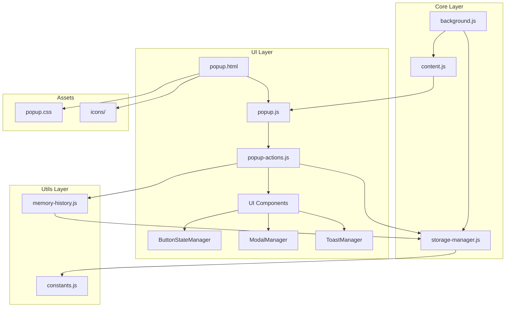

# 開發指南 | Development Guide

> ChatGPT Memory Toolkit v1.6.2 開發者設定與貢獻指南  
> Developer setup and contribution guide for ChatGPT Memory Toolkit v1.6.2

---

## 目錄 | Table of Contents

- [開發環境設定](#開發環境設定--development-setup)
- [專案結構](#專案結構--project-structure)
- [開發工作流程](#開發工作流程--development-workflow)
- [程式碼規範](#程式碼規範--coding-standards)
- [貢獻指南](#貢獻指南--contribution-guide)
- [發布流程](#發布流程--release-process)

---

## 開發環境設定 | Development Setup

### 🛠️ 前置需求

**必要軟體**:
- **Node.js**: 18.18.0 或更高版本 (支援 ES Modules)
- **npm**: 最新版本 (或 yarn)
- **Git**: 版本控制系統
- **Chrome**: 88+ 版本 (開發和測試)
- **VS Code**: 推薦的程式碼編輯器

**推薦的 VS Code 擴充套件**:
```json
{
  "recommendations": [
    "esbenp.prettier-vscode",
    "dbaeumer.vscode-eslint",
    "bradlc.vscode-tailwindcss",
    "ms-vscode.vscode-json",
    "formulahendry.auto-rename-tag",
    "christian-kohler.path-intellisense",
    "ms-vscode.vscode-typescript-next"
  ]
}
```

### 🚀 快速開始

**1. 克隆專案**:
```bash
git clone https://github.com/your-username/chatgpt-memory-toolkit.git
cd chatgpt-memory-toolkit
```

**2. 安裝依賴**:
```bash
# 使用 npm
npm install

# 或使用 yarn
yarn install
```

**3. 環境配置**:
```bash
# 複製環境配置範本
cp .env.example .env.local

# 編輯配置檔案
nano .env.local
```

**.env.local 範例**:
```bash
# 開發模式設定
NODE_ENV=development
DEBUG_MODE=true

# 測試設定
PUPPETEER_HEADLESS=false
TEST_TIMEOUT=30000

# 建置設定
GENERATE_SOURCEMAP=true
MINIMIZE_CODE=false
```

**4. 開發建置**:
```bash
# 開發模式（包含程式碼檢查和建置）
npm run dev

# 或僅建置
npm run build
```

**5. 載入擴充套件**:
1. 開啟 Chrome 並前往 `chrome://extensions/`
2. 啟用「開發人員模式」
3. 點擊「載入未封裝項目」
4. 選擇專案根目錄

### 🔧 開發工具配置

**ESLint 配置** (`.eslintrc.js`):
```javascript
export default {
  extends: [
    'eslint:recommended',
    '@eslint/js/recommended',
    'plugin:security/recommended',
    'prettier'
  ],
  plugins: ['security', 'prettier'],
  env: {
    browser: true,
    es2022: true,
    webextensions: true,
    node: true,
    jest: true
  },
  parserOptions: {
    ecmaVersion: 2022,
    sourceType: 'module'
  },
  rules: {
    'prettier/prettier': 'error',
    'no-console': process.env.NODE_ENV === 'production' ? 'error' : 'warn',
    'no-debugger': process.env.NODE_ENV === 'production' ? 'error' : 'warn',
    'no-unused-vars': ['error', { argsIgnorePattern: '^_' }],
    'prefer-const': 'error',
    'no-var': 'error'
  }
};
```

**Prettier 配置** (`.prettierrc.js`):
```javascript
export default {
  semi: true,
  trailingComma: 'es5',
  singleQuote: true,
  printWidth: 80,
  tabWidth: 2,
  useTabs: false,
  bracketSpacing: true,
  arrowParens: 'avoid',
  endOfLine: 'lf'
};
```

---

## 專案結構 | Project Structure

### 📁 目錄架構

```
chatgpt-memory-toolkit/
├── .github/                    # GitHub 工作流程和範本
│   ├── workflows/
│   │   ├── test.yml           # CI/CD 測試流程
│   │   └── release.yml        # 發布自動化
│   ├── ISSUE_TEMPLATE/        # Issue 範本
│   └── PULL_REQUEST_TEMPLATE.md
├── src/                       # 主要原始碼
│   ├── background.js          # Service Worker (Manifest V3)
│   ├── scripts/
│   │   └── content.js         # Content Script
│   ├── ui/                    # 使用者介面
│   │   ├── components/        # UI 組件
│   │   │   ├── ButtonStateManager.js
│   │   │   ├── ModalManager.js
│   │   │   ├── ToastManager.js
│   │   │   └── index.js
│   │   ├── popup.html         # 主要彈出視窗
│   │   ├── popup.css          # 樣式表
│   │   ├── popup.js           # 彈出視窗邏輯
│   │   └── popup-actions.js   # 動作處理器
│   └── utils/                 # 工具模組
│       ├── constants.js       # 常數定義
│       ├── storage-manager.js # 儲存管理
│       └── memory-history.js  # 歷史記錄
├── tests/                     # 測試檔案
│   ├── unit/                  # 單元測試
│   ├── integration/           # 整合測試
│   ├── e2e/                   # 端對端測試
│   └── utils/                 # 測試工具
├── assets/                    # 靜態資源
│   └── icons/                 # 圖示檔案
├── scripts/                   # 建置腳本
│   ├── build.js              # 建置腳本
│   └── update-version.cjs    # 版本更新
├── docs/                      # 文件
├── archive/                   # 歸檔檔案
├── manifest.json             # Chrome 擴充套件配置
├── package.json              # npm 配置
├── eslint.config.js          # ESLint 配置
├── prettier.config.js        # Prettier 配置
├── jest.config.js            # Jest 測試配置
└── README.md                 # 專案說明
```

### 🔗 檔案關係圖



---

## 開發工作流程 | Development Workflow

### 🔄 標準開發流程

**1. 分支策略**:
```bash
main        # 穩定版本，用於發布
├── develop # 開發主分支
├── feature/# 功能開發分支
├── hotfix/ # 緊急修復分支
└── release/# 發布準備分支
```

**2. 功能開發流程**:
```bash
# 1. 從 develop 創建功能分支
git checkout develop
git pull origin develop
git checkout -b feature/add-export-templates

# 2. 開發功能
# ... 編寫程式碼 ...

# 3. 執行測試和檢查
npm run lint
npm run test
npm run build

# 4. 提交變更
git add .
git commit -m "feat: add export templates functionality"

# 5. 推送到遠端
git push origin feature/add-export-templates

# 6. 創建 Pull Request
# 透過 GitHub 介面創建 PR
```

### 📝 提交訊息規範

**Conventional Commits 格式**:
```
<type>[optional scope]: <description>

[optional body]

[optional footer(s)]
```

**提交類型**:
- `feat`: 新功能
- `fix`: 錯誤修復
- `docs`: 文件更新
- `style`: 程式碼格式化
- `refactor`: 程式碼重構
- `test`: 測試相關
- `chore`: 建置或輔助工具變更

**範例**:
```bash
feat(ui): add purple gradient export animation
fix(storage): resolve memory leak in cache management
docs(api): update API reference for v1.6.2
refactor(components): modernize button state management
test(e2e): add comprehensive export workflow test
```

### 🧪 開發中測試

**開發期間的測試指令**:
```bash
# 監視模式運行測試
npm run test:watch

# 執行特定測試檔案
npm test -- ButtonStateManager.test.js

# 除錯模式運行 E2E 測試
npm run test:e2e:debug

# 產生覆蓋率報告
npm run test:coverage

# 執行效能測試
npm run test:performance
```

**測試驅動開發 (TDD) 流程**:
```bash
# 1. 編寫失敗的測試
npm test -- --watch NewFeature.test.js

# 2. 編寫最少的程式碼使測試通過
# ... 實作功能 ...

# 3. 重構程式碼並確保測試仍然通過
npm run lint:fix
npm test
```

---

## 程式碼規範 | Coding Standards

### 📋 JavaScript 程式碼規範

**1. ES Modules 使用**:
```javascript
// ✅ 正確的模組匯入/匯出
export class ButtonStateManager {
  constructor() {
    this.states = new Map();
  }
}

import { ButtonStateManager } from './ButtonStateManager.js';

// ❌ 避免的舊式模組語法
const ButtonStateManager = require('./ButtonStateManager');
module.exports = ButtonStateManager;
```

**2. 非同步程式設計**:
```javascript
// ✅ 使用 async/await
async function exportMemory() {
  try {
    const status = await getMemoryStatus();
    const content = await extractContent(status);
    return await saveExport(content);
  } catch (error) {
    console.error('Export failed:', error);
    throw error;
  }
}

// ❌ 避免回調地獄
function exportMemory(callback) {
  getMemoryStatus((status) => {
    extractContent(status, (content) => {
      saveExport(content, callback);
    });
  });
}
```

**3. 錯誤處理**:
```javascript
// ✅ 明確的錯誤處理
class StorageManager {
  async get(key, defaultValue = null) {
    try {
      const result = await chrome.storage.local.get(key);
      return result[key] ?? defaultValue;
    } catch (error) {
      console.error(`Storage get error for key "${key}":`, error);
      return defaultValue;
    }
  }
}

// ❌ 忽略錯誤
async function getData(key) {
  const result = await chrome.storage.local.get(key);
  return result[key];
}
```

**4. 類別和函數設計**:
```javascript
// ✅ 清晰的類別設計
class ModalManager {
  #activeModals = new Map();
  #modalStack = [];
  
  constructor(options = {}) {
    this.container = options.container || document.body;
    this.setupGlobalListeners();
  }
  
  /**
   * 顯示模態視窗
   * @param {Object} config - 模態配置
   * @returns {Promise<string>} 使用者選擇結果
   */
  async showModal(config) {
    this.validateConfig(config);
    const modal = this.createModal(config);
    return this.displayModal(modal);
  }
  
  // 私有方法使用 # 前綴
  #validateConfig(config) {
    if (!config.id) {
      throw new Error('Modal config must include an id');
    }
  }
}
```

### 🎨 CSS 規範

**1. CSS 變數使用**:
```css
/* ✅ 使用 CSS 變數建立設計系統 */
:root {
  --primary-color: #667eea;
  --secondary-color: #764ba2;
  --success-color: #10b981;
  --warning-color: #f59e0b;
  --error-color: #ef4444;
  
  --border-radius: 8px;
  --box-shadow: 0 4px 6px rgba(0, 0, 0, 0.1);
  --transition: all 0.3s ease;
}

.export-button {
  background: linear-gradient(135deg, var(--primary-color), var(--secondary-color));
  border-radius: var(--border-radius);
  transition: var(--transition);
}
```

**2. BEM 命名規範**:
```css
/* ✅ BEM 方法論 */
.modal {}                    /* Block */
.modal__header {}            /* Element */
.modal__button {}            /* Element */
.modal--large {}             /* Modifier */
.modal__button--primary {}   /* Element Modifier */

/* ❌ 避免的命名方式 */
.modalHeader {}
.modal .header {}
.largeModal {}
```

**3. 響應式設計**:
```css
/* ✅ Mobile-first 響應式設計 */
.popup-container {
  width: 320px;
  padding: 16px;
}

@media (min-width: 480px) {
  .popup-container {
    width: 400px;
    padding: 24px;
  }
}

@media (min-width: 768px) {
  .popup-container {
    width: 500px;
    padding: 32px;
  }
}
```

### 📝 文件規範

**JSDoc 註解**:
```javascript
/**
 * 管理按鈕視覺狀態和動畫效果
 * @class ButtonStateManager
 * @example
 * const manager = new ButtonStateManager();
 * manager.setExportingState(button, { duration: 3000 });
 */
class ButtonStateManager {
  /**
   * 設定匯出動畫狀態
   * @param {HTMLElement} buttonElement - 目標按鈕元素
   * @param {Object} options - 配置選項
   * @param {number} [options.duration=2000] - 動畫持續時間
   * @param {boolean} [options.particles=true] - 是否顯示粒子效果
   * @param {string} [options.text='匯出中...'] - 按鈕文字
   * @throws {Error} 當按鈕元素不存在時拋出錯誤
   * @returns {void}
   */
  setExportingState(buttonElement, options = {}) {
    // 實作...
  }
}
```

---

## 貢獻指南 | Contribution Guide

### 🤝 如何貢獻

**1. 問題回報**:
```markdown
# Bug Report Template

## 問題描述
簡潔描述遇到的問題

## 重現步驟
1. 前往 '...'
2. 點擊 '...'
3. 出現錯誤

## 預期行為
描述應該發生的正確行為

## 實際行為
描述實際發生的行為

## 環境資訊
- OS: Windows 10
- Chrome 版本: 91.0.4472.124
- 擴充套件版本: 1.6.2

## 附加資訊
任何有助於理解問題的額外資訊
```

**2. 功能建議**:
```markdown
# Feature Request Template

## 功能概述
簡潔描述建議的功能

## 問題背景
說明這個功能要解決的問題

## 建議解決方案
描述你認為的最佳解決方案

## 替代方案
描述其他可能的解決方案

## 附加內容
任何有關的截圖、原型或參考資料
```

**3. Pull Request 流程**:
```bash
# 1. Fork 專案到你的 GitHub 帳號

# 2. 克隆 Fork 的專案
git clone https://github.com/your-username/chatgpt-memory-toolkit.git

# 3. 創建功能分支
git checkout -b feature/amazing-feature

# 4. 實作變更並提交
git commit -m "feat: add amazing feature"

# 5. 推送到你的 Fork
git push origin feature/amazing-feature

# 6. 在 GitHub 上創建 Pull Request
```

### ✅ Pull Request 檢查清單

**提交前檢查**:
- [ ] 所有測試都通過 (`npm run test:all`)
- [ ] 程式碼通過 Lint 檢查 (`npm run lint`)
- [ ] 程式碼已格式化 (`npm run format`)
- [ ] 新功能包含適當的測試
- [ ] 更新了相關文件
- [ ] 提交訊息符合規範
- [ ] 分支基於最新的 develop

**PR 描述範本**:
```markdown
## 變更摘要
簡潔描述這個 PR 的變更內容

## 變更類型
- [ ] Bug 修復
- [ ] 新功能
- [ ] 重構
- [ ] 文件更新
- [ ] 其他

## 測試
- [ ] 單元測試
- [ ] 整合測試
- [ ] 手動測試

## 檢查清單
- [ ] 程式碼遵循專案規範
- [ ] 自我檢閱程式碼變更
- [ ] 新增適當的測試
- [ ] 測試全部通過
- [ ] 更新相關文件

## 螢幕截圖（如適用）
[附上相關的螢幕截圖]

## 其他資訊
任何其他相關資訊
```

### 🎯 貢獻準則

**程式碼品質**:
- 遵循現有的程式碼風格和架構模式
- 編寫清楚的註解和文件
- 包含適當的錯誤處理
- 確保向後相容性

**測試要求**:
- 新功能必須包含測試
- 測試覆蓋率不能降低
- 所有測試必須通過
- 包含邊界情況測試

**文件更新**:
- 更新 API 文件（如適用）
- 更新使用者指南（如適用）
- 更新 CHANGELOG.md
- 更新 README.md（如適用）

---

## 發布流程 | Release Process

### 🚀 版本管理

**語義化版本控制**:
```
MAJOR.MINOR.PATCH
  │     │     │
  │     │     └── 錯誤修復和小改進
  │     └────────── 新功能（向後相容）
  └──────────────── 重大變更（可能不向後相容）
```

**版本更新指令**:
```bash
# 補丁版本（錯誤修復）
npm run version:patch

# 次要版本（新功能）
npm run version:minor

# 主要版本（重大變更）
npm run version:major

# 自動化發布（包含 git tag）
npm run release:patch
npm run release:minor
npm run release:major
```

### 📦 發布檢查清單

**發布前準備**:
- [ ] 所有功能開發完成
- [ ] 所有測試通過（包含 E2E）
- [ ] 效能測試達標
- [ ] 安全掃描通過
- [ ] 文件已更新
- [ ] CHANGELOG.md 已更新
- [ ] 版本號已更新

**發布流程**:
```bash
# 1. 確保在 develop 分支
git checkout develop
git pull origin develop

# 2. 創建發布分支
git checkout -b release/v1.6.3

# 3. 執行完整測試
npm run test:all

# 4. 更新版本號
npm run version:patch

# 5. 更新 CHANGELOG
# 手動編輯 CHANGELOG.md

# 6. 提交發布變更
git add .
git commit -m "chore: prepare release v1.6.3"

# 7. 合併到 main
git checkout main
git merge release/v1.6.3

# 8. 創建 git 標籤
git tag -a v1.6.3 -m "Release version 1.6.3"

# 9. 推送到遠端
git push origin main
git push origin v1.6.3

# 10. 合併回 develop
git checkout develop
git merge main
git push origin develop

# 11. 刪除發布分支
git branch -d release/v1.6.3
```

### 🏪 Chrome Web Store 發布

**發布到 Chrome Web Store**:
1. **準備發布包**:
   ```bash
   npm run build:production
   npm run package
   ```

2. **Chrome Developer Dashboard**:
   - 登入 [Chrome Developer Dashboard](https://chrome.google.com/webstore/developer/dashboard)
   - 上傳新版本的 ZIP 檔案
   - 更新商店清單資訊
   - 提交審核

3. **發布後驗證**:
   - 確認新版本在商店中可見
   - 測試自動更新功能
   - 監控錯誤報告和用戶回饋

---

## 🛠️ 開發工具與指令

### 📋 常用開發指令

```bash
# 開發相關
npm run dev              # 開發模式（檢查 + 建置）
npm run build            # 生產建置
npm run watch            # 監視檔案變更並自動建置
npm run clean            # 清理建置檔案

# 程式碼品質
npm run lint             # 執行 ESLint 檢查
npm run lint:fix         # 自動修復 ESLint 問題
npm run format           # 執行 Prettier 格式化
npm run format:check     # 檢查程式碼格式

# 測試相關
npm test                 # 執行所有測試
npm run test:unit        # 執行單元測試
npm run test:integration # 執行整合測試
npm run test:e2e         # 執行端對端測試
npm run test:watch       # 監視模式執行測試
npm run test:coverage    # 產生覆蓋率報告

# 版本管理
npm run version:patch    # 遞增補丁版本
npm run version:minor    # 遞增次要版本
npm run version:major    # 遞增主要版本
```

### 🔧 偵錯工具

**Chrome DevTools 偵錯**:
```javascript
// 在擴充套件中使用 debugger
function exportMemory() {
  debugger; // 在這裡設定中斷點
  // 程式碼邏輯...
}

// 使用 console 群組
console.group('Export Process');
console.log('Starting export...');
console.log('Memory status:', status);
console.groupEnd();
```

**VS Code 偵錯配置** (`.vscode/launch.json`):
```json
{
  "version": "0.2.0",
  "configurations": [
    {
      "name": "Launch Chrome Extension",
      "type": "chrome",
      "request": "launch",
      "url": "chrome://extensions/",
      "webRoot": "${workspaceFolder}/src",
      "sourceMaps": true
    },
    {
      "name": "Run Tests",
      "type": "node",
      "request": "launch",
      "program": "${workspaceFolder}/node_modules/.bin/jest",
      "args": ["--runInBand"],
      "console": "integratedTerminal",
      "internalConsoleOptions": "neverOpen"
    }
  ]
}
```

---

## 🌐 社群與支援 | Community & Support

### 🤝 參與社群

**溝通管道**:
- **GitHub Discussions**: 功能討論和 Q&A
- **GitHub Issues**: Bug 回報和功能請求
- **Pull Requests**: 程式碼貢獻

**社群準則**:
- 尊重所有貢獻者
- 建設性的回饋和討論
- 遵循行為準則
- 協助新手開發者

### 📚 學習資源

**Chrome Extensions 開發**:
- [Chrome Extensions Documentation](https://developer.chrome.com/docs/extensions/)
- [Manifest V3 Migration Guide](https://developer.chrome.com/docs/extensions/mv3/intro/)
- [Chrome Extensions Samples](https://github.com/GoogleChrome/chrome-extensions-samples)

**JavaScript 和 Web 技術**:
- [MDN Web Docs](https://developer.mozilla.org/)
- [JavaScript.info](https://javascript.info/)
- [ES6 Features](https://github.com/lukehoban/es6features)

**測試和品質保證**:
- [Jest Documentation](https://jestjs.io/docs/getting-started)
- [Puppeteer Documentation](https://pptr.dev/)
- [ESLint Rules](https://eslint.org/docs/rules/)

---

## ❓ 常見問題 | FAQ

### 🔧 開發相關

**Q: 為什麼使用 ES Modules 而不是 CommonJS？**
A: ES Modules 是現代 JavaScript 標準，提供更好的樹搖優化、靜態分析和工具支援。Chrome Extensions 在 Manifest V3 中也更好地支援 ES Modules。

**Q: 如何在開發時偵錯 Service Worker？**
A: 在 `chrome://extensions/` 中點擊「服務工作者」連結，或在 DevTools 的 Application 標籤中查看 Service Workers。

**Q: 測試覆蓋率低於標準怎麼辦？**
A: 首先識別未覆蓋的程式碼區域，然後編寫對應的測試。重點關注邊界情況和錯誤處理路徑。

### 🐛 常見問題解決

**Q: npm install 失敗**
```bash
# 清除 npm 快取
npm cache clean --force

# 刪除 node_modules 和 package-lock.json
rm -rf node_modules package-lock.json

# 重新安裝
npm install
```

**Q: ESLint 錯誤**
```bash
# 自動修復可修復的錯誤
npm run lint:fix

# 檢查特定檔案
npx eslint src/path/to/file.js
```

**Q: 測試失敗**
```bash
# 清除 Jest 快取
npx jest --clearCache

# 執行特定測試檔案
npm test -- ButtonStateManager.test.js

# 除錯模式執行測試
npm test -- --verbose --no-cache
```

---

**開發指南版本**: v1.6.2  
**最後更新**: 2025-08-01  
**維護者**: ChatGPT Memory Toolkit Development Team

---

> 🚀 **歡迎加入開發！**  
> 我們歡迎所有形式的貢獻，無論是程式碼、文件、測試或是想法。讓我們一起建立更好的 ChatGPT 記憶管理工具！